# Introduction

Welcome to **SUSTracker**, your all-in-one personal health assistant web application designed to help you stay motivated, organized, and on track with your fitness journey. This wellness tracking app can help you set and achieve personalized workout goals, log your daily meals to monitor your calorie intake, and keep a detailed record as well as overall statistics of your completed workouts. With features like easy gym booking and engaging user competitions, SUSTracker not only promotes healthy habits but also lets you compete with other like-minded individuals to stay motivated. Start taking control of your health today—with SUSTracker, every step counts.

# Sign up as a User

The first step in your fitness journey is to sign up for an account. You can either click the 'Sign up' button in the top right corner, the 'Start tracking' button in the center of the main page, or scroll all the way to the bottom and click the 'Get Started Now' button to start making your account.

They will take you to the page shown below, where you can fill in your details to sign up for an account. After entering your information into each field, select the 'Regular User' role to log into the app as a user. For the 'Gym Owner' role, refer to the '[[#Sign up as a Gym Owner]]' section. Finalize your account by clicking the 'Create Account' button.

## Features

As a user, you’ll have access to a range of intuitive tools designed to support and enhance every step of your fitness journey.

### Statistics

As the first page that greets you after logging in, the statistics page provides quick action buttons for convenient access to the most frequently used features: "Log Meal", "Log Workouts", and "View Bookings". It also displays your greatest achievements for a boost in motivation as well as detailed workout statistics to help you get a sense of how much you're improving over time.

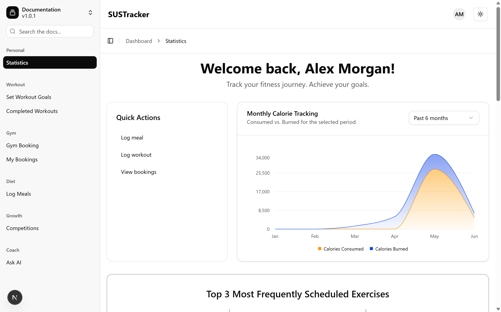

There are several data we feature here: monthly calorie tracking, top 3 most frequently scheduled exercises, total workouts completed per month, best records (heaviest lifts & most reps), total workout volume per month, as well as performance metrics such as longest streak and completion rate.

### Set Workout Goals

At SUSTracker, we understand that setting goals for the future is essential in staying consistent with your workouts. This page is here to help you define your fitness objectives and plan a workout ahead of time by choosing the exercises you want to do for that day. Simply click the **"Add New Workout Plan"** button to get started.

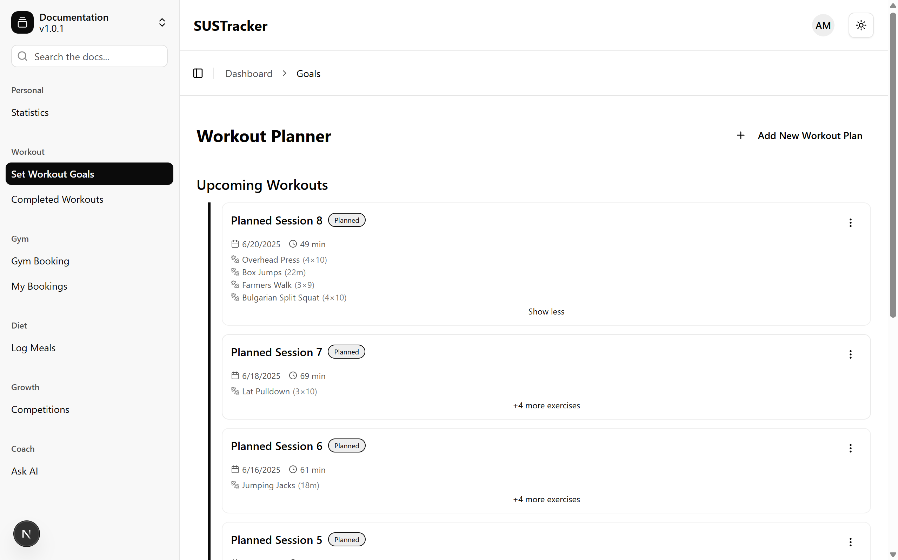

Once inside, you can give your workout plan a **title**, **select the date**, and **add specific exercises** by choosing the activity, number of reps, and sets. All your plans will be automatically organized by date, making it easy to stay on track.

Need to make changes? You can always **edit your existing workout plans** to better fit your evolving routine.

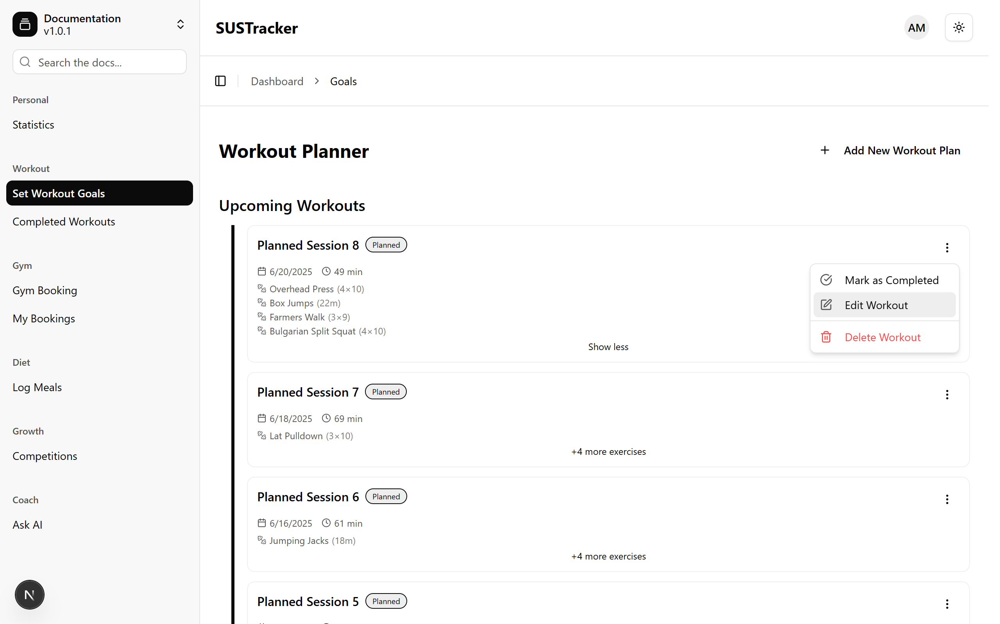

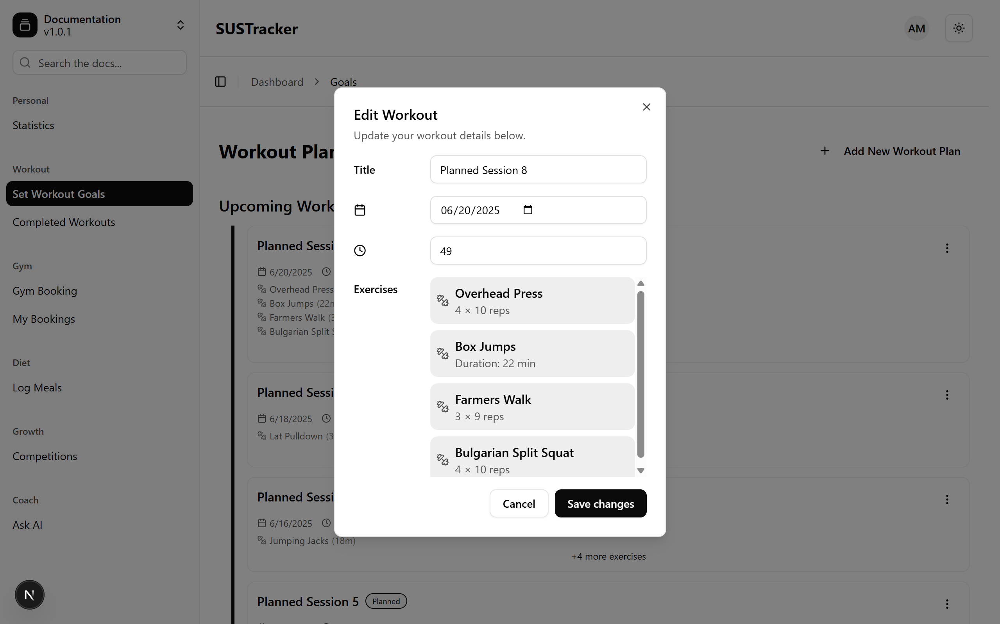

When you’ve completed a planned workout, mark it as **completed**, and it will be automatically moved to the **Completed Workouts** page—helping you visualize your progress and celebrate every milestone.

### Completed Workouts

You’ve set your fitness goals—now it’s time to follow through. This page lets you record the workouts you’ve completed each day, helping you track your progress and stay motivated as you move closer to your fitness objectives.

The **Completed Workouts** page stores workouts that you’ve actually done. These records can come directly from the workouts you planned on the **Set Workout Goals** page or be manually entered. Just like when setting your goals, you’ll be able to specify the title, date, exercise, number of reps, and sets for each workout.

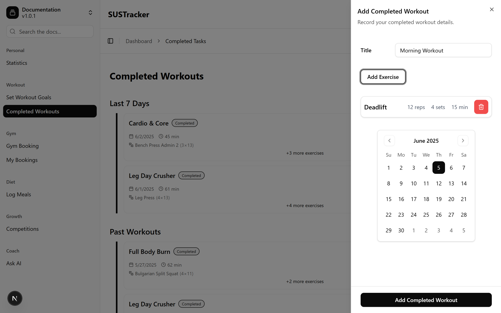

Need to make a change? No problem—you can edit previously added workouts at any time. All the data you log here is also automatically summarized in the **Statistics** page, giving you a clear picture of your performance over time.

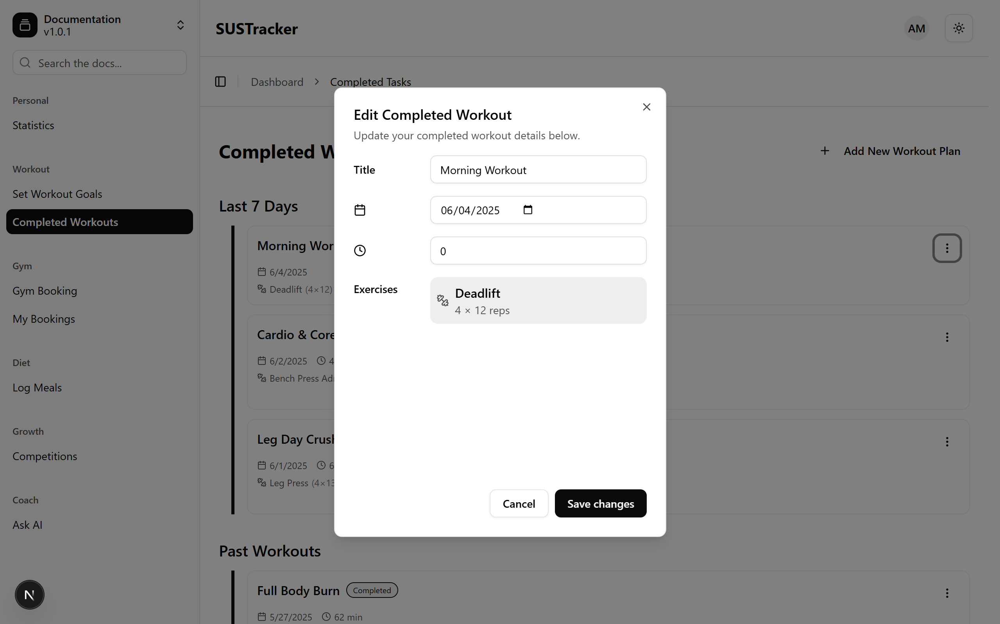

### Gym Booking

Finding the right gym has never been easier. Explore a variety of gyms available on our platform and book memberships or classes that align with your schedule and fitness preferences—all in just a few taps.

### My Bookings

Stay organized and in control. This page gives you a complete overview of your gym memberships and class reservations, making it easy to view, manage, or update your bookings anytime.

### Log Meals

Fuel your body the smart way. The **Log Meals** page helps you keep track of everything you eat, making it easier to monitor your daily calorie intake and ensure your nutrition stays aligned with your fitness goals.

The page displays your meal history from the past 7 days, neatly grouped by date and sorted from the most recent to the oldest. This makes it easy to spot trends and reflect on your eating habits over the week.

Adding a meal is simple—just tap the **plus (+) button** located at the bottom right corner of the screen. You’ll then be guided to input the meal details:

- **Title**: Choose from common suggestions like _Breakfast_, _Lunch_, _Dinner_, or _Snack_, or type in your own custom title.

- **Date and Time**: Specify when the meal took place.

- **Food and Quantity**: Select the food items and input the quantity consumed.

Once everything is filled in, just click the **Add Meal** button to save your entry.

Want to review what you’ve eaten? Just tap any meal card to view its full details. From there, you can also choose to edit or delete the meal if needed—giving you full control over your nutrition log.

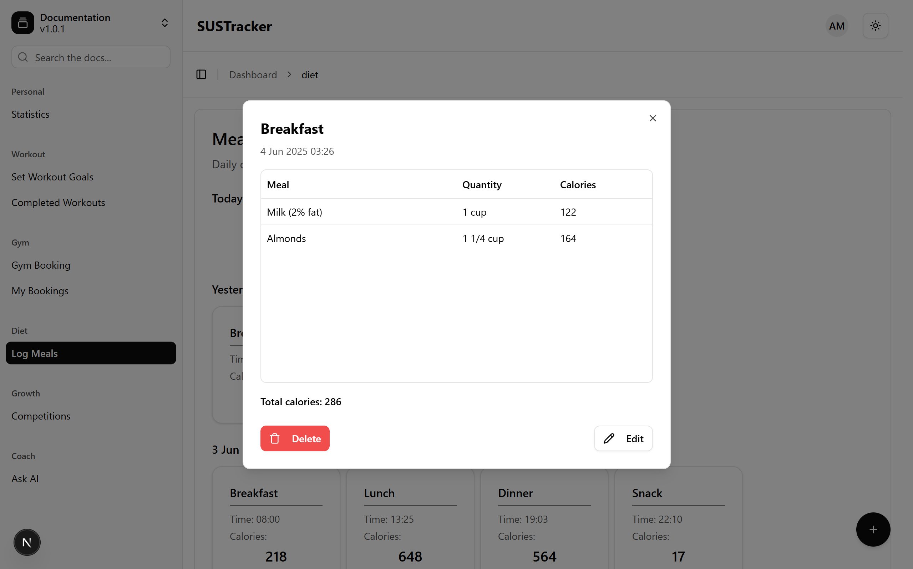

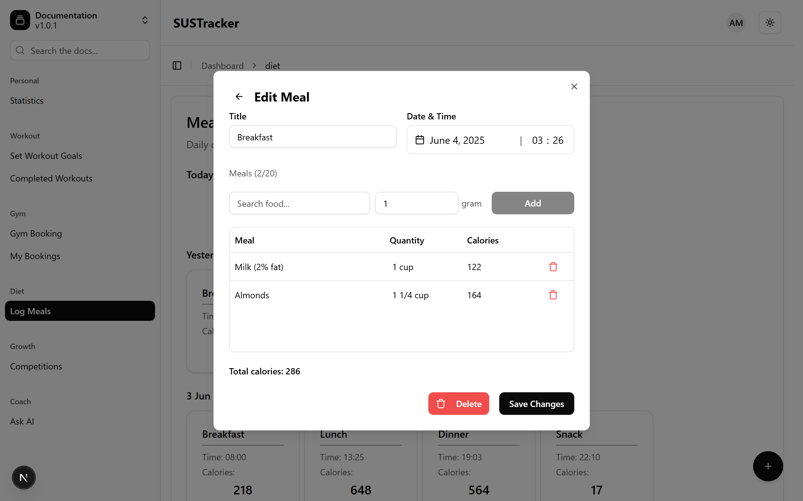

### Competitions

Push your limits and have fun! Join fitness challenges and compete with other users to stay motivated, earn rewards, and celebrate your achievements along the way.

### Ask AI

Need quick advice or workout tips? Our AI chatbot is available to provide instant guidance, personalized suggestions, and support whenever you need help staying on track.

Whether you have questions about fitness, nutrition, or general health topics, you can chat directly with the AI to get the answers you need. Every conversation is automatically saved, so you can revisit past chats anytime for reference or continued learning.

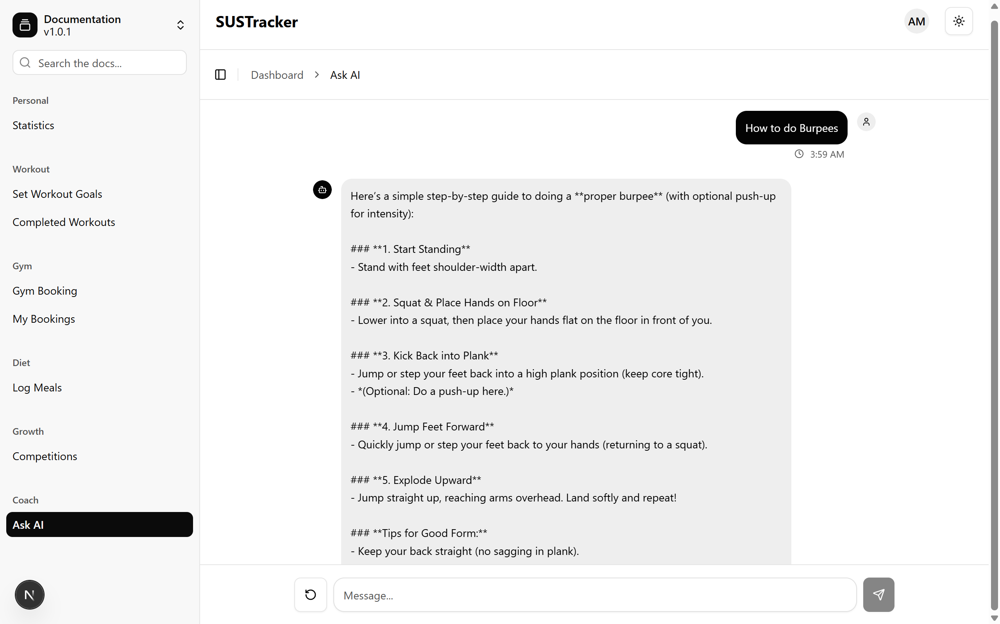

### Settings

Update your preferences, manage account settings, and tailor the app to better support your personal fitness journey. You can access the **Settings** page by clicking your profile picture icon in the top-right corner and selecting the option from the dropdown menu.

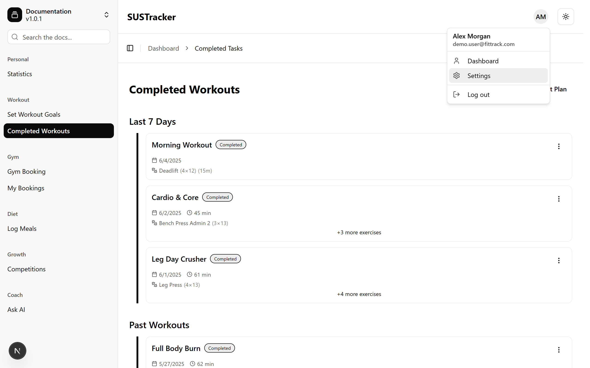

From there, you can update your **profile picture**, modify your **personal information**, and adjust various settings to customize your experience with SUSTracker.

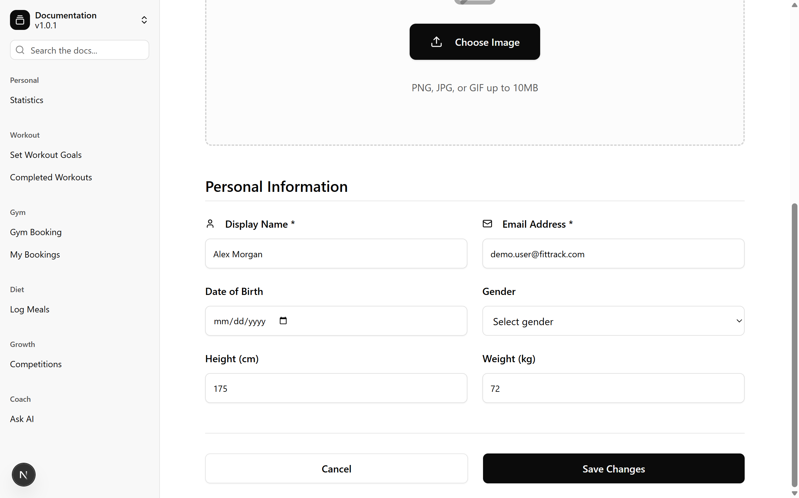

# Sign up as a Gym Owner

At SUSTracker, we understand that gym owners need a powerful and efficient platform to promote their facilities and reach potential members. That’s why we’ve created a dedicated tool within our web application specifically for gym owners—allowing you to easily register and showcase your gym to a growing community of health-conscious users. By joining SUSTracker, you can advertise your gym’s location, services, and amenities, making it easier for users to discover and book memberships directly through the app. We’re here to help you grow your business while supporting our users in achieving their fitness goals.

To sign up for this role, you can either click the 'Sign up' button in the top right corner, the 'Start tracking' button in the center of the main page, or scroll all the way to the bottom and click the 'Get Started Now' button.

They will take you to the page shown below, where you can fill in your details to sign up for an account. After entering your information into each field, select the 'Regular User' role to log into the app as a user. For the 'Gym Owner' role, refer to the '[[#Sign up as a Gym Owner]]' section. Finalize your account by clicking the 'Create Account' button.

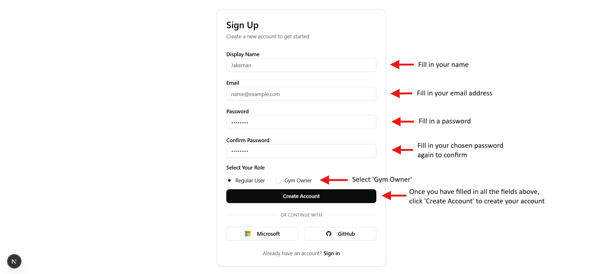

## Features

As a gym owner, you’ll have access to a set of powerful tools designed to help you promote your facility, manage memberships, and connect with a community of motivated fitness enthusiasts.

### Owner Dashboard

Your personalized dashboard gives you a clear view of all your registered gyms and allows you to easily manage and update gym information, including memberships, classes, and competitions.

### Create Gym

### View Competitions

### View Classes

# Log in as an Admin

The admin role was designed to help oversee the health and growth of the SUSTracker platform by providing the tools needed to manage user activity, monitor trends, and ensure a seamless experience for all. With access to detailed analytics and engagement data, administrators can make informed decisions, address potential issues proactively, and guide the platform’s development in a strategic direction. This role plays a crucial part in maintaining the integrity of the app, supporting both users and gym owners, and driving continuous improvement across the entire ecosystem.

To log in as an administrator, you'll need to use this account when signing in:

> email address: test@example.com
> 
> password: password123

## Features

As an administrator, you’ll have access to valuable data insights that help you get a comprehensive view of the app’s growth, identify opportunities for improvement, and ensure a smooth and efficient experience for all users.

### Admin Dashboard

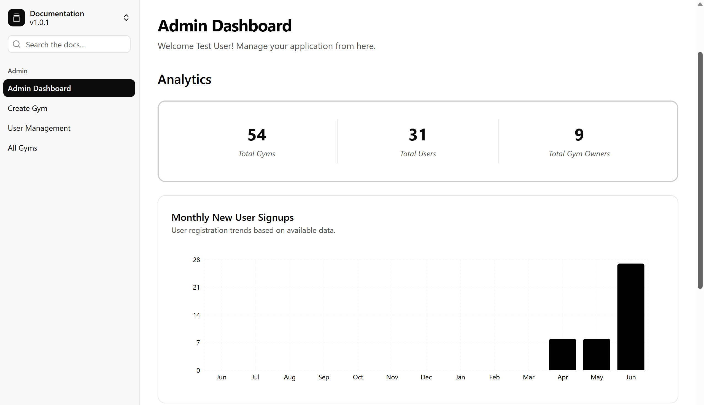
